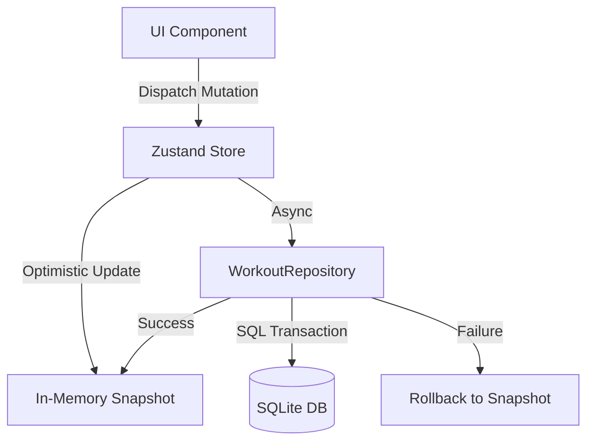

# PearLift

**A local‑first, privacy‑focused workout tracker with progressive overload, rest timers, and peer‑to‑peer sync.**

PearLift is a React Native app built with Expo. It helps you log sets, manage progressive overload, and time your rests—all without an account. Your data stays on your device and syncs directly between your own devices using the Holepunch P2P stack. You can also share workout plans with friends as read‑only copies.

<p align="center">
  
</p>

---

## ✨ Features

- **🏋️ Workout Program Management**  
  Define multi‑week programs with load modifiers and RIR targets. Reorder days and exercises via drag‑and‑drop.

- **📊 Weight Tracking & Progressive Overload**  
  Automatic weight adjustments based on week modifiers. Support for both kg and lb with proper rounding.

- **⏱️ Resilient Rest Timer**  
  Persistent timer that survives app restarts. On Android, a foreground service keeps it running in the background. Haptics and sound on completion.

- **📁 Local Backup & Restore**  
  Export/import all data as a JSON file. Preview changes before applying a backup to avoid accidental overwrites.

- **📡 Device‑to‑Device Sync**  
  Sync your workouts across your own devices seamlessly and privately. Powered by the Holepunch P2P stack, data never touches a cloud server.

- **👥 Share Workout Plans**  
  Send a read‑only copy of your program to a friend. They can preview and import it into their own app. Cryptographic keys ensure they cannot modify your original.

- **🔒 Privacy First**  
  No accounts, no cloud servers. All data lives in a local SQLite database and syncs directly between trusted devices.

---

## 🧱 Tech Stack

| Layer                | Technology                                                                                       |
| -------------------- | ------------------------------------------------------------------------------------------------ |
| Framework            | [Expo SDK 55](https://docs.expo.dev/) + [React Native 0.83](https://reactnative.dev/)            |
| State Management     | [Zustand](https://github.com/pmndrs/zustand) + custom optimistic SQLite persistence              |
| Database             | [expo‑sqlite](https://docs.expo.dev/versions/latest/sdk/sqlite/)                                  |
| Animations           | [React Native Reanimated 4](https://docs.swmansion.com/react-native-reanimated/)                  |
| Drag & Drop          | [react-native-sortables](https://github.com/margelo/react-native-sortables)                       |
| Background Timer     | Custom native module (Android) + `expo-notifications` fallback                                     |
| Peer‑to‑Peer Sync    | [Holepunch (Pear) stack](https://docs.pears.com/) – Autobase, Hypercore, Hyperswarm, Corestore   |
| P2P React Native     | [react-native-bare-kit](https://github.com/holepunchto/react-native-bare-kit)                     |

---

## 📲 Installation & Development

> **Note:** PearLift uses Bun as the package manager and requires Expo CLI.

```bash
# Clone the repository
git clone https://github.com/Okazakee/PearLift.git
cd PearLift

# Install dependencies
bun install

# Start the development client
bun run start

# Run on Android
bun run android

# Run on iOS
bun run ios
```

### Environment Requirements
- Node.js ≥ 20
- Bun ≥ 1.3
- Expo Go or development build on your device

---

## 🗂️ Project Structure (Simplified)

```
├── App.tsx                 # Font loading, notifications, root view
├── components/
│   ├── modals/             # Settings, Add/Edit Exercise, Backup, Sync Setup, Share
│   ├── RestTimer.tsx       # Persistent timer with SVG ring & native handoff
│   ├── WorkoutView.tsx     # Exercise grid with drag‑to‑reorder
│   └── Navigation.tsx      # Sortable day tabs
├── screens/
│   └── WorkoutScreen.tsx   # Main container, orchestrates all modals & views
├── storage/
│   ├── workoutRepository.ts # SQLite repository with optimistic updates
│   └── types.ts            # Zustand store types
├── store/
│   └── workoutStore.ts     # Zustand actions & optimistic UI
├── sync/
│   ├── corestore.ts        # Holepunch Corestore instance & key management
│   ├── autobase.ts         # Multi‑writer conflict resolution
│   ├── swarm.ts            # Hyperswarm peer discovery & connections
│   └── share.ts            # Read‑only sharing logic (public Hypercores)
├── backup/
│   └── localBackup.ts      # JSON import/export, diff preview
├── native/
│   └── restTimerForegroundService.ts # Bridge to Android foreground service
├── theme/
│   └── tokens.ts           # Material‑like color system with light/dark themes
└── utils/                  # Units conversion, math, timer helpers
```

---

## 🧠 How It Works

### Local Data Flow



1. **Mutations** are dispatched from UI (e.g., `adjustExerciseWeight`).
2. The Zustand store **optimistically updates** the in‑memory snapshot for instant feedback.
3. The mutation is sent to the `WorkoutRepository`, which performs the SQLite write.
4. If the write fails, the store reverts to the last known good snapshot from the database.

### Peer‑to‑Peer Sync Architecture

PearLift uses the Holepunch stack to enable direct device‑to‑device sync without any central server.

```mermaid
graph TD
    subgraph "Device A"
        A_App[App UI] --> A_Autobase[Autobase]
        A_Autobase --> A_Input[Input Hypercore]
        A_Autobase --> A_View[View Hypercore]
        A_View --> A_SQLite[(SQLite DB)]
        A_Swarm[Hyperswarm] <--> A_Autobase
    end

    subgraph "Device B"
        B_App[App UI] --> B_Autobase[Autobase]
        B_Autobase --> B_Input[Input Hypercore]
        B_Autobase --> B_View[View Hypercore]
        B_View --> B_SQLite[(SQLite DB)]
        B_Swarm[Hyperswarm] <--> B_Autobase
    end

    A_Swarm <-->|P2P Encrypted Channel (via DHT)| B_Swarm
```

- **Corestore** manages a collection of Hypercores—one per device (input log) and a unified view log.
- **Autobase** combines input logs from all synced devices into a single, causally‑ordered view using a "last‑write‑wins" conflict resolution strategy.
- **Hyperswarm** discovers other devices on the same "topic" (your unique sync key) and establishes direct encrypted connections via UDP holepunching.
- **SQLite** remains the local source of truth; Autobase writes the merged state back to SQLite for seamless UI integration.

### Sync Setup Flow

1. Enable sync in Settings – a unique cryptographic seed is generated and stored securely in `expo-secure-store`.
2. On a second device, scan the QR code or enter the seed phrase to join the same sync group.
3. Devices discover each other automatically and begin exchanging data logs.
4. Conflict resolution merges any offline changes the next time devices connect.

### Rest Timer Persistence

- Timer state is saved to `AsyncStorage` so it can be restored after app kill.
- On Android, a **foreground service** (`pearlift-rest-timer-fgs`) takes over when the app goes to the background, ensuring the timer completes and shows a notification.
- When the app returns, it reconciles the state from the native module.

### Read‑Only Sharing

Share a workout plan or week configuration with a friend without giving them edit access.

1. From any workout or program, tap **Share**.
2. The app creates a **public Hypercore** containing a snapshot of the selected data.
3. A shareable link or QR code is generated containing only the **public key** (read‑only).
4. The recipient's app downloads the data directly from your device via Hyperswarm.
5. Because they lack the secret write key, the Hypercore is cryptographically read‑only. They can preview and import the plan into their own local database.

---

## 🤝 Contributing

Contributions are welcome! Please open an issue to discuss what you'd like to change or add.

1. Fork the repo
2. Create a feature branch (`git checkout -b feature/amazing-feature`)
3. Commit your changes (`git commit -m 'Add some amazing feature'`)
4. Push to the branch (`git push origin feature/amazing-feature`)
5. Open a Pull Request

---

## 📄 License

PearLift is open‑source software licensed under the **MIT License**. See [LICENSE](LICENSE) for details.

---

## 💬 Acknowledgements

- [Expo](https://expo.dev/) for the amazing toolchain.
- [Holepunch](https://holepunch.to/) for building a truly peer‑to‑peer future.
- The open‑source community for all the great libraries used in this project.

---

*Built with ❤️ by [Okazakee](https://github.com/Okazakee)*