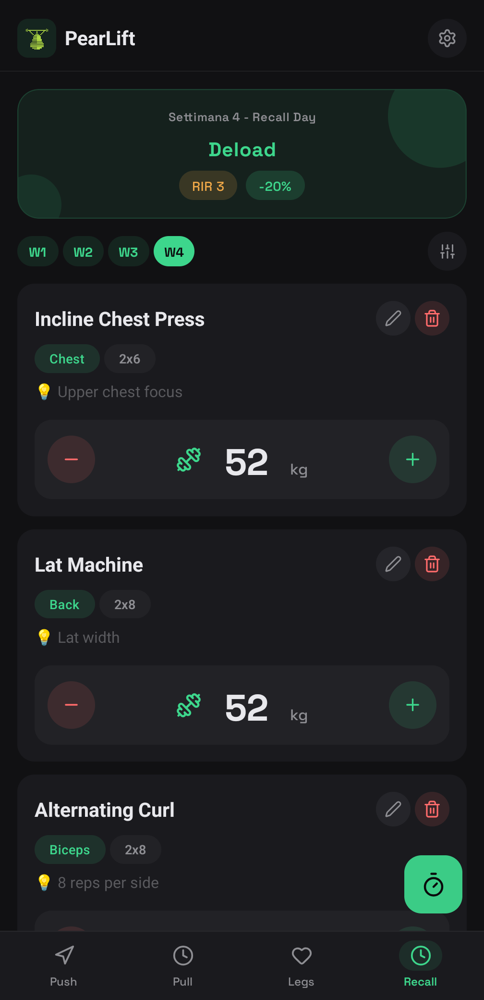
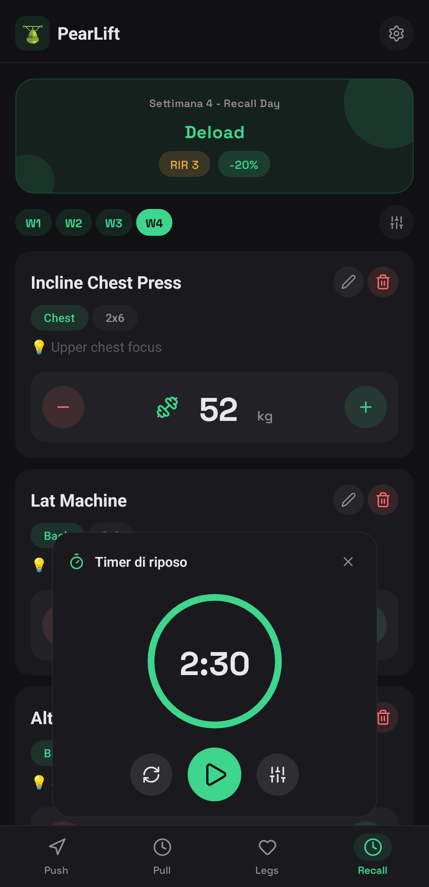
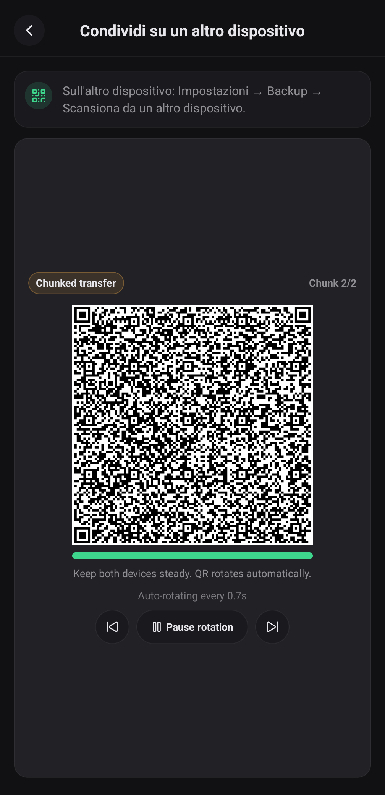

#  PearLift

*Local-first, privacy-focused workout tracker built with Expo & React Native*

<div align="center">
  <a href="./LICENSE">
    
  </a>
  <a href="https://expo.dev/">
    
  </a>
  <a href="https://reactnative.dev/">
    
  </a>
</div>

---

## Features

- **Multi-day workout programs** with reordering and structured progression
- **Weight tracking** with kg/lb support and automatic overload adjustments
- **Android background rest timer** support through a local foreground-service module
- **Local backups** with export/import and QR-based device transfer
- **Device sync** with cross-device room invites via Holepunch
- **No account required** — your data stays with you
- **Privacy-first** — no proprietary analytics, ads, or tracking SDKs

## Screenshots

<div align="center">
  
  
  
</div>

## Quick Start

Clone the repo and install dependencies:

```bash
git clone https://github.com/Okazakee/PearLift.git
cd PearLift
bun install
bun run start
```

Useful commands:
- `bun run android` — run on Android device/emulator
- `bun run lint` — lint the codebase
- `bun run typecheck` — run TypeScript checks
- `bun run site:preview` — preview the website

## Android Releases

```bash
bun run prebuild -- --clean --platform android
bun run android:release:apk
bun run android:release:aab
```

Release and store documentation:
- [Release guide](./docs/RELEASING.md)
- [Store metadata](./docs/STORE_METADATA.md)
- [Asset provenance](./docs/ASSET_PROVENANCE.md)

## Privacy & Support

- **Website**: [pearlift.okazakee.dev](https://pearlift.okazakee.dev/)
- **Privacy Policy**: [pearlift.okazakee.dev/privacy/](https://pearlift.okazakee.dev/privacy/) (source: [docs/privacy/index.html](./docs/privacy/index.html))
- **Issue Tracker**: [GitHub Issues](https://github.com/Okazakee/PearLift/issues)
- **Source Repository**: [github.com/Okazakee/PearLift](https://github.com/Okazakee/PearLift)

## License

PearLift is licensed under the [MIT License](./LICENSE).
